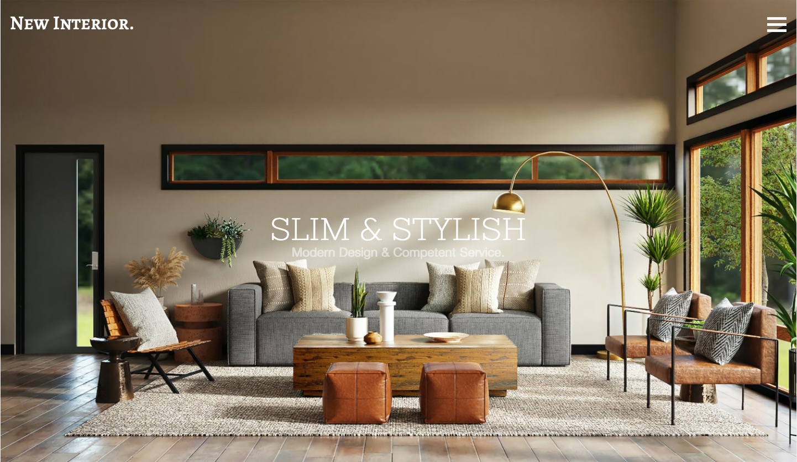

1

# New Interior Website

This project showcases a modern and stylish interior design website built using HTML and CSS. It features a responsive design suitable for various screen sizes.

## Screenshots

## Live Demo

Check out the live demo of the New Interior website [here](https://shakedown3000.github.io/project_new_interior/).

## Project Overview

The New Interior website includes the following sections:

- **Header**: Featuring a navigation menu and a hero section with a slogan.
- **Latest Works**: Displays recent products with interactive hover effects.
- **Services**: Highlights different design services offered.
- **From the Blog**: Shares blog articles with images and summaries.
- **Testimonials**: Features testimonials from satisfied customers.
- **Get a Quote**: Allows visitors to request a free quote.
- **Contact Us**: Provides a form for visitors to get in touch.

## Technologies Used

- HTML
- CSS

## Contributors

- [Anna Laube](https://github.com/shakedown3000)
- [Pablo Beckg](https://github.com/pablobeckg)

## Acknowledgments

This project was developed as part of a final assignment. Special thanks to [Pablo Beckg](https://github.com/pablobeckg) for collaboration.

